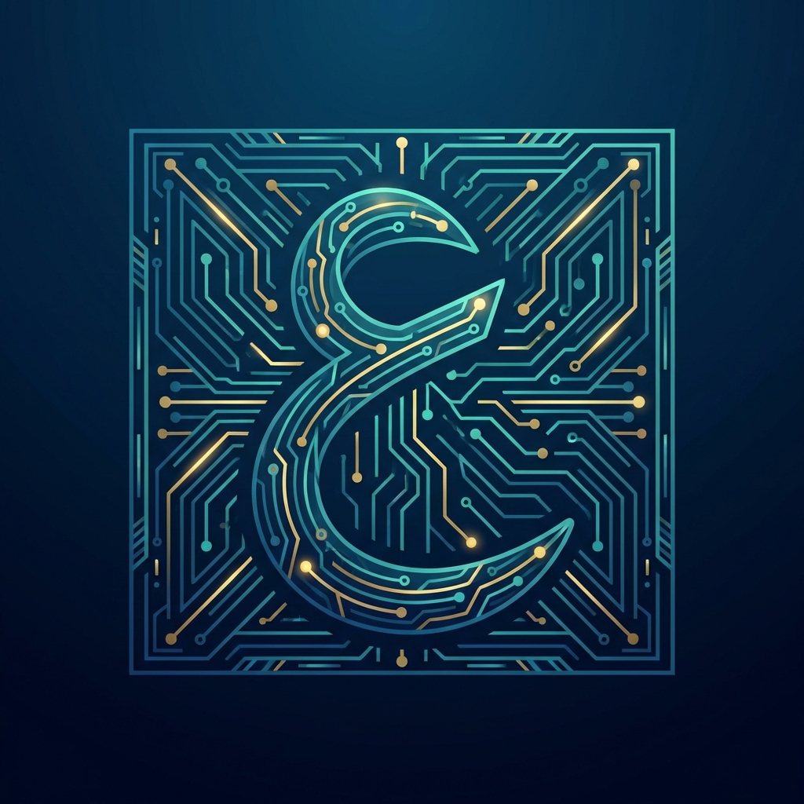

# Awesome Arabic AI 🚀

  
  
<b>Centralizing Advancements in Arabic Large Language Models (LLM), Text-to-Speech (TTS), and Speech-to-Text (STT)</b>

  
  
  

---

## 📖 Introduction

**Awesome-Arabic-AI** is the definitive hub for open-source advancements in Arabic Large Language Models (LLMs), Text-to-Speech (TTS), and Speech-to-Text (STT) technologies. Arabic, spoken by over 400 million people, presents unique computational challenges—from its complex morphology and lack of diacritics to the profound state of **diglossia** (the gap between MSA and spoken dialects). 

Our mission is to centralize high-quality, open-weight models and research benchmarks to provide a strategic foundation for developers navigating the burgeoning Arabic AI ecosystem. We aim to foster a community where state-of-the-art speech and language technologies are accessible and optimized for the linguistic richness of the Arab world.

> [!TIP]
> **Why Arabic AI?**
> Developing for Arabic requires specialized tokenizers, diacritization-aware pipelines, and multi-dialectal datasets. This repository highlights the tools that solve these specific hurdles.

---

## 🗺️ Table of Contents

- [Arabic TTS Excellence](#-arabic-tts-excellence)
- [Dialectal AI (Egyptian Arabic)](#-dialectal-ai-egyptian-arabic)
- [Datasets](#-datasets)
- [Model Comparison Table](#-model-comparison-table)
- [Large Language Models (LLMs)](#-large-language-models-llms)
- [Speech-to-Text (STT)](#-speech-to-text-stt)
- [Key Researchers & Organizations](#-key-researchers--organizations)
- [Contributing](#-contributing)
- [License](#-license)

---

## 🎙️ Arabic TTS Excellence

These models represent the cutting edge of open-source Arabic speech synthesis.

| Model Name | Developer/Author | Links | Notes |
| :--- | :--- | :--- | :--- |
| **Arabic-F5-TTS-v2** | Ibrahim Salah | [Model](https://huggingface.co/IbrahimSalah/Arabic-F5-TTS-v2) | Advanced F5-based Arabic TTS |
| **Arabic-TTS-Spark** | Ibrahim Salah | [Space](https://huggingface.co/spaces/IbrahimSalah/Arabic-TTS-Spark) | Spark-based Arabic synthesis |
| **Chatterbox-Egyptian** | oddadmix | [Model](https://huggingface.co/oddadmix/chatterbox-egyptian-v0) / [Demo](https://huggingface.co/spaces/oddadmix/Chatterbox-Egyptian) | Focus on Egyptian Dialect |
| **Habibi-TTS** | SWivid | [Model/Dataset](https://huggingface.co/datasets/SWivid/Habibi) | High-quality Arabic speech dataset & model |
| **Hamsa** | Silma AI | [Org](https://huggingface.co/silma-ai) | High-end Arabic TTS |
| **XTTS-v2 (Arabic)** | Coqui/Community | [Link](https://huggingface.co/lucasnewman/xtts-v2-arabic) | Multi-lingual support with Arabic fine-tuning |

### Benchmarks & Evaluation
*   **Primary Arabic TTS Benchmark:** [Silma Open Source Arabic TTS Benchmark](https://huggingface.co/spaces/silma-ai/opensource-arabic-tts-benchmark)
*   **Comparison Targets:** ElevenLabs, Google Gemini TTS, Google Chirp 3, Amazon Polly, OpenAI TTS Mini.

---

## 🇪🇬 Dialectal AI (Egyptian Arabic)

Specialized resources focusing on the unique challenges of the Egyptian dialect.

- **[Chatterbox-Egyptian](https://huggingface.co/oddadmix/chatterbox-egyptian-v0)**: A state-of-the-art model designed specifically for Egyptian dialect synthesis.
- **[EGTTS-v0.1](https://huggingface.co/models?search=EGTTS)**: Community effort for Egyptian dialect speech.

---

## 📊 Datasets

Critical resources for training and fine-tuning Arabic models.

- **[Habibi Dataset](https://huggingface.co/datasets/SWivid/Habibi)**: A high-quality Arabic speech dataset, essential for developing natural-sounding TTS systems.
- **[Common Voice (Arabic)](https://commonvoice.mozilla.org/ar)**: Community-driven speech dataset.

---

## ⚖️ Model Comparison Table

Comparing leading open-source models against proprietary industry standards.

| Feature | Hamsa (Silma AI) | Arabic-F5 v2 | Chatterbox-EG | ElevenLabs | Google Gemini TTS |
| :--- | :--- | :--- | :--- | :--- | :--- |
| **Type** | Open-Source | Open-Source | Open-Source | Proprietary | Proprietary |
| **Focus** | High-end MSA | Performance/Prosody | Egyptian Dialect | Global Standard | High Integration |
| **Latency** | Low (Optimized) | Moderate | Moderate | Variable (API) | Low (API) |
| **Access** | Downloadable | Downloadable | Downloadable | API-Only | API-Only |

---

## 🧠 Large Language Models (LLMs)

### Featured Arabic-Centric Models
- **[AraModernBert (NAMAA)](https://huggingface.co/namaa-space/AraModernBert-Base-V1.0)**: Advanced Arabic language model based on ModernBERT architecture (Dec 2024).
- **[Falcon-H1-Arabic (3B, 7B, 34B)](https://huggingface.co/tiiuae)**: Latest models from TII with hybrid Mamba-Transformer architecture for superior Arabic performance (Jan 2026).
- **[Jais (G42)](https://huggingface.co/inceptionai/jais-30b-chat)**: Arabic-centric foundational model.
- **[Falcon 3 (TII)](https://huggingface.co/tiiuae/falcon-3-7b)**: High-performance multilingual models.
- **[Allam (KSAA)](https://huggingface.co/KSAA)**: Saudi sovereign model.

### Llama-3-Arabic Variants
- **[Arabic-llama3.1-16bit-FT](https://huggingface.co/Omartificial-Intelligence-Space/Arabic-llama3.1-16bit-FT)**: Fine-tuned on BigScience xP3.
- **[HeshamHaroon/Arabic-llama3](https://huggingface.co/HeshamHaroon/Arabic-llama3)**: Fine-tuned from Meta Llama 3.
- **[arazn-llama3-arabic-gguf](https://huggingface.co/ahmedheakl/arazn-llama3-arabic-gguf)**: Quantized version for edge deployment.

---

## 🎙️ Speech-to-Text (STT)

### Foundational & Fine-tuned Models
- **[ArTST v2](https://huggingface.co/MBZUAI/ArTST)**: Unified Transformer for Arabic text and speech, supporting 17 dialects.
- **[Whisper Large V3 Turbo (Arabic)](https://huggingface.co/mboushaba/whisper-large-v3-turbo-arabic)**: High-speed throughput fine-tuned for Arabic.
- **[Whisper-Large-V2-Arabic-5k](https://huggingface.co/clu-ling/whisper-large-v2-arabic-5k-steps)**: High accuracy on Common Voice.
- **[Whisper-Medium-Egyptian](https://huggingface.co/MAdel121/whisper-medium-egy)**: Specialized for Egyptian Arabic dialect.

---

## 👥 Key Researchers & Organizations

- **[NAMAA Community](https://huggingface.co/namaa-space)**: Leading open-source collective for Arabic NLP, creators of `AraModernBert` and dialect-specific translation models.
- **[Ibrahim Salah](https://huggingface.co/IbrahimSalah)**: Specialist in F5 and Spark TTS.
- **[oddadmix](https://huggingface.co/oddadmix)**: Focus on Dialectal/Egyptian AI.
- **[SWivid](https://huggingface.co/SWivid)**: Creators of the Habibi dataset.
- **[Silma AI](https://huggingface.co/silma-ai)**: Leading Arabic Benchmarks and high-end models.
- **[TII (Technology Innovation Institute)](https://huggingface.co/tiiuae)**: Developers of Falcon and primary Arabic leaderboards.
- **[MBZUAI](https://huggingface.co/MBZUAI)**: Leaders in ArTST and ArabicMMLU.

---

## 🤝 Contributing

We welcome contributions! Please see [CONTRIBUTING.md](CONTRIBUTING.md) for guidelines.

---

## 📜 License

Distributed under the Apache 2.0 License. See `LICENSE` for more information.

---

  Built with ❤️ for the Arabic AI Community.

